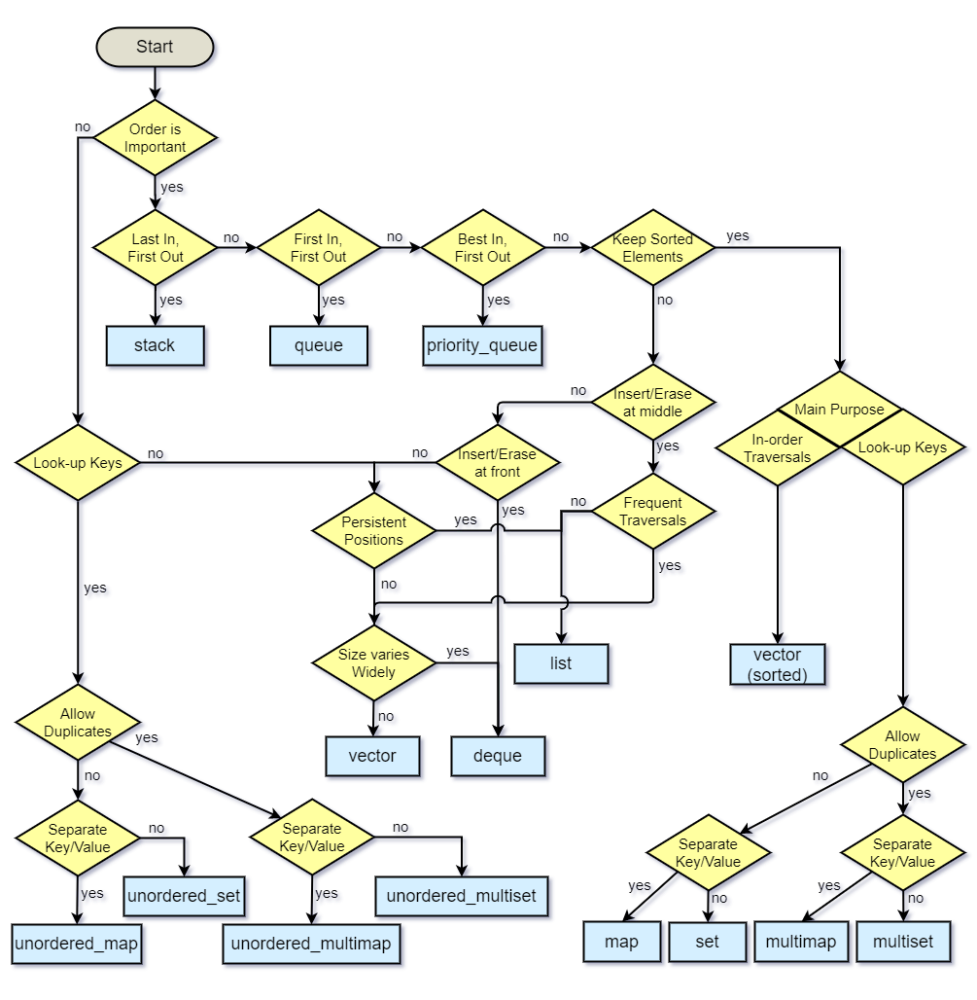

# Container Flow Chart

## Download
Download your own copy of the Flow Chart [here](https://drive.google.com/file/d/1wAUsTIeKRgSfo0m-3rR4P6Boi3FuixEk/view).

## Summary
This Flow Chart was originally uploaded to stackoverflow in .PNG format [here](https://stackoverflow.com/questions/471432/in-which-scenario-do-i-use-a-particular-stl-container/22671607#22671607). Since no editable version of the Flow Chart existed, I created one so that programmers, learning about data structures and algorithms, like myself, could create their own variations with ease.

## Contributions
Any implementations of non-existing paths or alternative / new data structures are highly appreciated! Also, improvements to pre-existing paths and data structures are highly welcome!

### Steps to contribute to this project
1. Download your own copy of the Editable Flow Chart .xml file from [here](https://drive.google.com/file/d/1wAUsTIeKRgSfo0m-3rR4P6Boi3FuixEk/view?usp=sharing).
2. Go to [app.diagrams.net](https://app.diagrams.net/) and open the flow chart .xml file you just downloaded in step 1 with:

    `File > Open from > Device`.
3. Modify the flow chart however you'd like.
4. Export your modified flow chart with: 

    `File > Export as > XML > Select only "Compressed" and "All Pages" > Export > Device`
5. Fork this repo. (Guide: [Fork a Repo by GitHub](https://docs.github.com/en/github/getting-started-with-github/fork-a-repo))
6. Download your fork locally. (Guide: [Create a Local Clone of Your Fork by GitHub](https://docs.github.com/en/github/getting-started-with-github/fork-a-repo#step-2-create-a-local-clone-of-your-fork))
7. Open the root directory of the forked repo you just download in step 5 and swap out the pre-existing `containers_flow_chart.xml` file with your modified version.
8. Create a pull request from your fork. (Guide: [Creating a Pull Request From a Fork by GitHub](https://docs.github.com/en/github/collaborating-with-issues-and-pull-requests/creating-a-pull-request-from-a-fork))

Once your pull request is submitted, I will review it and update the repo as soon as possible.